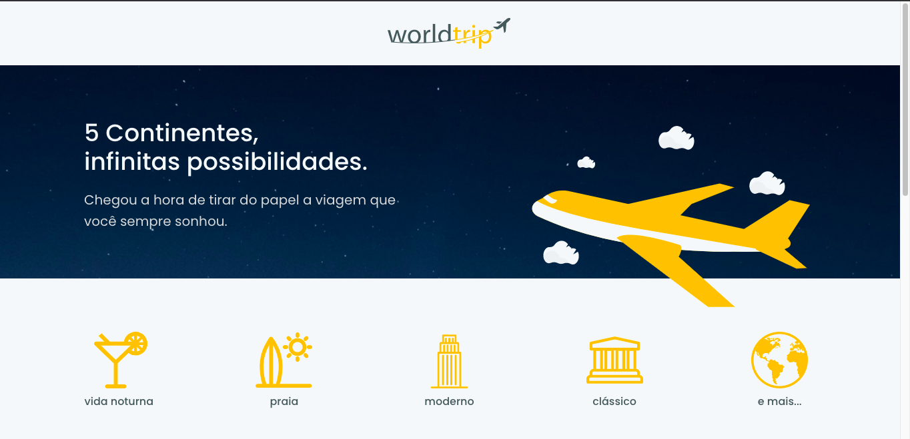
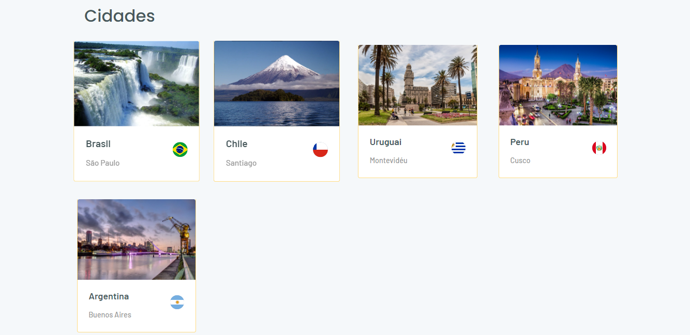

<br />
<br />
<h1 align="center">
   
 
  <br />
  <br />
  Nextjs | ReactJs | Typescript | Chakra UI | Axios | Framer motion | Swiper | Json server | SASS | SWR | React-icons
</h1>

<p align="center">
  
   <br />
</p> 
<br />
<br />

## :bookmark: Resumo
<br />

<p align="center">
     
</p>
<p align="center">
O <span>Worldtrip</span> é aplicativo que mostra os principais destinos turisticos de cada continente que foi construindo no desafio do Bootcamp Ignite da Rockeseat na trilha Reactjs.
</p>
<br />
<p align="center">
 
 
</p>

<br />


<br />

## :bulb: Tecnologias Utilizadas:
<br />

- Nextjs
- ReactJs
- Typescript
- Chakra UI
- React-icons
- Axios
- Fake Api 
- Framer motion
- SWR
- SASS
- Swiper
- Json server

<br />


## Desafios do projeto
  - [x] Construir o interface usando o chakra ui a partir do layout do Figma
  - [x] Trabalhar a reposividade da aplicação
  - [x] Criar animações (opcional) 

## Pré-requisitos

Antes de começar, você vai precisar ter instalado em sua máquina as seguintes ferramentas:
[Git](https://git-scm.com), [Node.js](https://nodejs.org/en/). 
Além disto é bom ter um editor para trabalhar com o código como [VSCode](https://code.visualstudio.com/)


## Como rodar o projeto

```bash
# Clone este repositório
$ git clone https://github.com/kaus1000/interface-com-Chakra-UI.git

# Acesse a pasta do projeto no terminal
$ cd interface-com-Chakra-UI

# Abra a pasta no Visual Studio Code
$ code .

# Instale as dependências
$ yarn

# Execute o servidor aplicação com o yarn
$ yarn server

# Execute a aplicação com o yarn
$ yarn dev

# O servidor inciará na porta:3000 - acesse <http://localhost:3000>
```


## :memo: License

Este projeto esta sob a [MIT license](LICENSE) para mais detalhes.
<br />
<br />

## :wave: Social

Siga @sergiodb121 nas redes :wink:
<br />

- [Instagram](https://www.instagram.com/sergiodb121/)
- [LinkedIn](https://www.linkedin.com/in/s%C3%A9rgio-damaceno-botelho-ab9a24184/)

<br />

Siga a @Rocketseat nas redes
<br />

- [Website](https://rocketseat.com.br/)
- [YouTube](https://www.youtube.com/channel/UCSfwM5u0Kce6Cce8_S72olg)
- [Instagram](https://www.instagram.com/rocketseat_oficial/?hl=pt-br)

